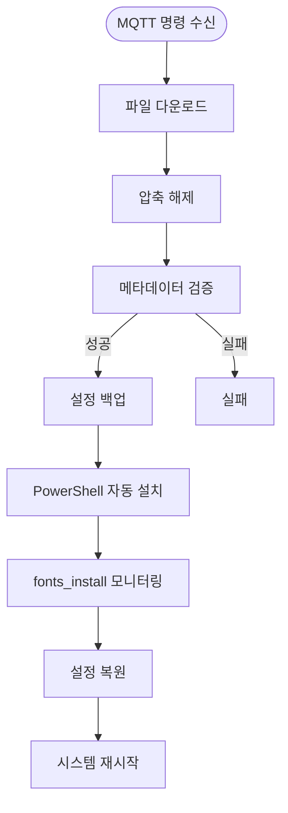

# AppLauncher

HBOT 챔버 소프트웨어 자동 실행 및 원격 업데이트 관리 프로그램

## 프로젝트 구조

```
AppLauncher/
├── Features/                           # 주요 기능 모듈
│   ├── AppLaunching/
│   │   └── ApplicationLauncher.cs      # 대상 프로그램 자동 실행
│   ├── MqttControl/
│   │   ├── MqttService.cs              # MQTT 클라이언트 서비스
│   │   └── MqttMessageHandler.cs       # MQTT 명령 처리 (업데이트, 위치 변경)
│   ├── TrayApp/
│   │   └── TrayApplicationContext.cs   # 시스템 트레이 앱
│   └── VersionManagement/
│       ├── LabViewUpdater.cs           # 챔버 소프트웨어 업데이트
│       ├── LauncherUpdater.cs          # 런처 자체 업데이트
│       └── PendingUpdateManager.cs     # 업데이트 예약 관리
├── Presentation/                       # UI 레이어
│   └── WinForms/
│       ├── MqttControlForm.cs          # MQTT 제어 창
│       ├── LauncherSettingsForm.cs     # 런처 설정 창 (MQTT 정보 포함)
│       ├── UpdateProgressForm.cs       # 업데이트 진행 화면 (전체화면)
│       └── MainForm.cs                 # 메인 폼
├── Shared/                             # 공통 유틸리티
│   ├── Configuration/
│   │   └── ConfigManager.cs            # 설정 파일 관리
│   ├── Logger/
│   │   ├── DebugLogger.cs              # 디버그 로깅
│   │   └── FileLogger.cs               # MQTT 로그 파일 관리
│   ├── Services/
│   │   ├── ServiceContainer.cs         # 전역 서비스 컨테이너
│   │   ├── FontInstallMonitor.cs       # fonts_install 프로세스 모니터링
│   │   └── UninstallSWService.cs       # 소프트웨어 제거 서비스
│   ├── HardwareInfo.cs                 # 하드웨어 정보 수집
│   ├── TaskSchedulerManager.cs         # 작업 스케줄러 관리
│   └── VersionInfo.cs                  # 버전 정보 관리
├── Properties/
│   └── AssemblyInfo.cs                 # 어셈블리 메타데이터
├── Program.cs                          # 진입점 및 초기화
├── AppLauncher.csproj                  # 프로젝트 파일
├── app.manifest                        # 관리자 권한 설정
├── app_icon.ico                        # 앱 아이콘
└── README.md                           # 이 파일
```

## 배포 경로 구조

### 프로그램 파일 (업데이트 시 교체)
```
C:\Program Files\AppLauncher\
  └─ AppLauncher.exe
```

### 데이터 파일 (업데이트해도 보존)
```
C:\ProgramData\AppLauncher\
  ├─ Data\                       (설정 파일)
  │   ├─ launcher_config.json    (런처 설정)
  │   └─ labview_version.txt     (설치된 버전)
  ├─ Downloads\                  (다운로드 임시 파일)
  │   ├─ [zip 파일]
  │   └─ Volume\                 (압축 해제된 설치 파일)
  ├─ Logs\                       (로그 파일 - 90일 자동 보관)
  │   ├─ MQTT_YYYYMMDD.log       (MQTT 통신 로그)
  │   └─ install_log_*.txt       (설치 로그)
  └─ Backup\                     (설정 백업)
      └─ setting_*.ini
```

### 사용자 문서 폴더
```
C:\Users\[사용자]\Documents\HBOT\Setting\
  └─ setting.ini                 (HBOT Operator 설정 파일)
```

## 빌드 명령어

### 배포용 (단일 실행 파일)
```bash
dotnet publish -c Release -r win-x64 --self-contained true -p:PublishSingleFile=true -p:PublishTrimmed=false -p:PublishReadyToRun=false
```

### 개발/테스트용
```bash
dotnet watch run
```

## 주요 기능

### 1. 챔버 소프트웨어 자동 실행
- 시스템 시작 시 HBOT Operator 자동 실행
- 프로세스 모니터링 및 자동 재시작
- 작업 스케줄러를 통한 자동 시작

### 2. 원격 업데이트 관리 (MQTT)
- **챔버 소프트웨어 업데이트**: ZIP 파일 다운로드 → 압축 해제 → 자동 설치
- **런처 자체 업데이트**: EXE 파일 다운로드 → 교체 → 재시작 시 적용
- **위치 변경**: MQTT Location 설정 변경
- **통신 로그 기록**: 모든 MQTT 활동을 파일로 자동 기록 (90일 보관)

### 3. 안전한 업데이트 프로세스
- 메타데이터 검증 (ProductName, CompanyName)
- 설정 파일 자동 백업 및 복원
- fonts_install 프로세스 자동 정리
- 구버전 파일 자동 정리

### 4. MQTT 로그 관리
- **자동 파일 기록**: 연결, 메시지 수신/전송, 오류 등 모든 이벤트를 파일로 기록
- **날짜별 로그 파일**: `MQTT_YYYYMMDD.log` 형식으로 일별 파일 생성
- **자동 정리**: 90일(3개월) 이전 로그 파일 자동 삭제
- **Tray 앱 독립**: 앱이 종료되어도 백그라운드에서 계속 기록
- **로그 위치**: `C:\ProgramData\AppLauncher\Logs\`

## 업데이트 플로우

### 챔버 소프트웨어 업데이트


### 런처 업데이트


## MQTT 명령어

### 챔버 소프트웨어 업데이트
```json
{
  "command": "LABVIEW_UPDATE",
  "URL": "https://example.com/update.zip",
  "version": "1.0.0.285"
}
```

### 런처 업데이트
```json
{
  "command": "LAUNCHER_UPDATE",
  "URL": "https://example.com/AppLauncher.exe"
}
```

### 위치 변경
```json
{
  "command": "LOCATION_CHANGE",
  "location": "Seoul"
}
```

### 상태 확인
```json
{
  "command": "STATUS"
}
```

## 설정 파일 (launcher_config.json)

```json
{
  "targetExecutable": "C:\\Program Files (x86)\\HBOT Operator\\HBOT Operator.exe",
  "localVersionFile": "labview_version.txt",
  "mqttSettings": {
    "broker": "localhost",
    "port": 1883,
    "location": ""
  }
}
```

## 개발 환경

- **.NET 9.0** (Windows Forms)
- **MQTTnet** 4.3.7.1207
- **Newtonsoft.Json** 13.0.3

## 주요 개선 사항

### v1.1.0 (2025-01-21)
- ✅ MQTT 파일 로깅 시스템 추가 (90일 자동 보관)
- ✅ ServiceContainer 패턴 도입으로 전역 서비스 관리 개선
- ✅ ObjectDisposedException 방어 코드 추가 (MqttControlForm)
- ✅ Null 안전성 개선 (`_sendStatusResponse` 등)
- ✅ 빌드 경고 개선 (34개 → 24개)
- ✅ 이벤트 핸들러 메모리 누수 방지
- ✅ MQTT 자동 재연결 로직 안정화 (최대 100회 제한)

## 라이선스

```text
 _______________________________________________________________________________________
< 본 프로젝트는 HBOT 챔버 시스템 관리를 위한 내부 도구입니다. >
 ----------------------------------------------------------------------------------------
        \
         \
          /\_/\  
         ( o.o )  
          > ^ <

```